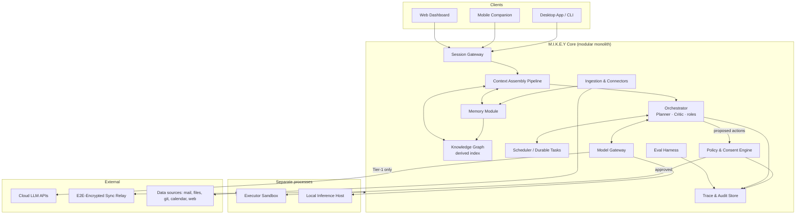
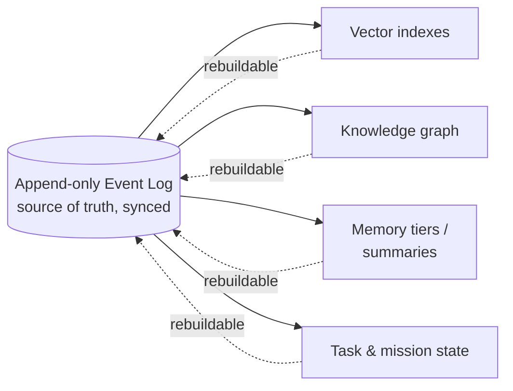
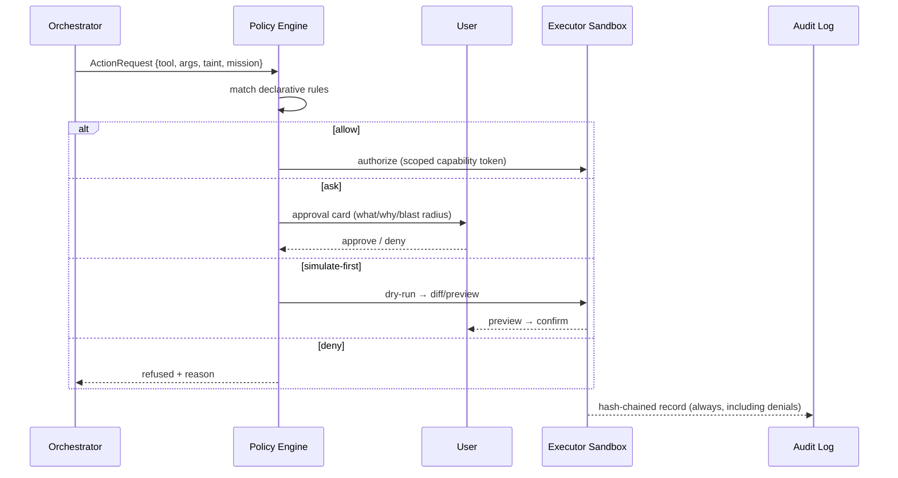

# M.I.K.E.Y — System Architecture (v0.1)

**Status:** Draft for implementation of Generation 1–3 · **Supersedes:** the implicit architecture in `00-vision.md`, per the corrections in `01-architecture-review.md`.

---

## 1. Architectural style

**Modular monolith core** (single process, strictly bounded internal modules) + **two mandatory external processes**:

1. **Executor Sandbox** — unprivileged, capability-scoped process that performs all side effects.
2. **Inference Host** — local model runner (can crash/OOM independently; also where GPU lives).

All inter-module communication inside the core goes through typed internal interfaces; the sandbox and inference host are reached over local IPC (gRPC over UDS/named pipes). Module boundaries are drawn so any module can later be extracted into a service without redesign.

**Why:** one developer, one machine, maximum iteration speed, real trust boundaries only where they buy safety (review §1.1).

## 2. System overview



**The spine of every turn:** `input → Context Assembly → Orchestrator (plan) → Policy Engine (authorize) → Executor (act) → Trace (record) → Memory (learn)`. Every capability in the vision document plugs into this spine; none bypasses it.

## 3. Trust boundaries & privacy tiers

| Tier | Data | May reach cloud? |
|---|---|---|
| **T0** | Credentials, health/finance records, anything user marks private | Never. Local inference only. Enforced at the Model Gateway, not by convention. |
| **T1** | General memories, documents, conversation context | Transient cloud inference allowed (no provider training/retention); never stored server-side in plaintext. |
| **T2** | Public/non-personal content (papers, web) | Freely. |

Sync payloads are always E2E-encrypted; the relay stores ciphertext blobs + device cursors and can be fully untrusted. **This resolves the E2EE-vs-cloud-intelligence contradiction (review W2): intelligence happens at the edges; the cloud between devices is a dumb pipe; cloud *inference* is a per-request, tier-gated choice.**

Untrusted-content taint: everything from Ingestion or the web carries `provenance: untrusted`. Tainted content may appear in model context but the Policy Engine refuses to let it *authorize* anything — approvals derive only from user input or standing user-granted rules.

## 4. Data model — the event log is the truth



Event envelope (versioned from day one — review M10):

```json
{
  "id": "evt_01J...",            // ULID, time-ordered
  "v": 1,                        // schema version
  "type": "conversation.message | ingest.document | action.executed | memory.written | mission.step | ...",
  "ts": "2026-07-21T10:00:00Z",
  "device": "dev_desktop_1",
  "tier": "T1",
  "provenance": {"source": "user | connector:gmail | agent", "trusted": true},
  "payload": { }
}
```

Derived stores (all local, all rebuildable):

- **SQLite** — event log, task state, config, audit chain. (Single-user scale; zero ops; battle-tested. Postgres only if/when a multi-user server exists.)
- **Vector index** — sqlite-vec/LanceDB embedded; per-source collections.
- **Graph** — nodes/edges *with provenance to source events*, stored relationally (SQLite) until scale demands otherwise; every edge knows which events justify it, so re-extraction and forgetting both work.
- **Memory tiers** — working (session), episodic (event-linked summaries), semantic (stable facts/preferences with confidence + staleness), procedural (compiled skills). Promotion between tiers is an explicit, logged, policied operation.

**Forgetting:** tombstone events; projections re-run excluding tombstoned lineage; backups age out. Deletion is verified by querying all projections for the lineage id.

## 5. Context Assembly Pipeline (the actual product)

Per turn, under a token budget:

1. **Candidates** — retrieve from vector indexes, graph neighborhood, active mission state, recent turns.
2. **Score** — relevance × recency × importance × confidence; contradiction check flags conflicts instead of silently including both.
3. **Compress** — summarize long candidates; drop below-threshold items.
4. **Assemble** — system frame + policies + task state + selected memories (each with source + age annotation) + user input.
5. **Record** — the exact assembled context is traced (M7), so "why did you say that" is answerable from data.

## 6. Orchestration — roles, not seventeen agents

Structural roles: **Planner** (decomposes into a step DAG), **Executor-caller** (binds steps to tools), **Critic/Verifier** (checks outputs against acceptance criteria before results are trusted), **Memory-writer** (proposes memory promotions).

Domain "agents" (research, coding, finance…) are **capability profiles**: `{prompt pack, tool allowlist, policy set, preferred model tier}` — data in a registry, not code. Adding "Presentation Agent" is writing a profile, not a subsystem (review W1).

**Missions** are durable task-DAGs owned by the Scheduler: persisted state machine per step (`pending → running → verify → done/failed(class)`), resumable after crash, with failure classes driving retry policy (review M12). A mission survives reboot because it is rows, not RAM.

## 7. Execution safety model



- Executor holds **capability tokens**, not ambient authority: filesystem scopes, egress allowlist, per-tool grants, TTL.
- Destructive/outward-facing classes (delete, send, publish, purchase, system-config) are `ask` or `simulate-first` by default; the user can grant standing rules, which are themselves logged config.
- **API-first automation** (bpy, UXP, AppleScript, COM, REST) preferred over screen-vision + synthetic input; pixels are the fallback tier with mandatory preview.
- Secrets are injected by the vault into tool calls at execution time and never enter model context.

## 8. Model Gateway

Single interface: `complete(request, {tier, capability, budget})` → routes to local inference host or cloud provider by privacy tier (hard constraint), task class, latency/cost budget, availability; uniform tool-calling schema; retries/fallback chains; token & cost metering feeding the Resource Governor (M8). Providers are adapters; no other module knows a vendor name. *Practical note: Gen 1 should not reinvent the agent loop — build the Gateway over an existing agent SDK/tool-use API and the MCP standard for connectors/tools, which is precisely the plugin protocol the vision asks for.*

## 9. Sync & multi-device

- Sync unit = encrypted event-log segments; per-device cursors; append-only merge (conflicts are rare and resolved by deterministic ordering + explicit conflict events).
- Devices rebuild their own projections locally; **derived state is never synced** (review W3).
- Mobile = companion surface: voice, camera capture → ingestion, notifications, **approval cards** (remote confirm for desktop actions — this is the killer mobile feature), read access to memory/missions. Not an execution surface (review §4 iOS).
- Continuity = same log + mission state everywhere; "continue on phone" is free once sync works.

## 10. Self-improvement loop (measured, gated)

```
trace (M7) → reflection proposes change (prompt/profile/skill/automation)
      → change enters eval harness (M3): golden tasks + personal corpus
      → pass: versioned adoption (rollback-able, M11)   fail: discarded, logged
```

Dream Mode = the Scheduler running maintenance jobs (compaction, re-embedding, graph re-extraction, eval runs, skill-compilation proposals) under idle/battery/thermal budgets, preemptible on user return. No self-change is adopted without passing evals. Ever.

## 11. Repository structure (Gen 1 target)

```
mikey/
├── docs/                    # this design corpus, ADRs in docs/adr/
├── core/
│   ├── gateway/             # session gateway (clients attach here)
│   ├── context/             # context assembly pipeline
│   ├── orchestrator/        # roles, mission DAGs, capability profiles
│   ├── policy/              # rules engine, approval flows, audit writer
│   ├── memory/              # event log, tiers, promotion, forgetting
│   ├── graph/               # extraction + graph projection
│   ├── ingest/              # connector framework + connectors/
│   ├── models/              # model gateway + provider adapters
│   ├── scheduler/           # durable tasks, dream-mode jobs
│   ├── trace/               # run traces, replay
│   └── eval/                # harness, golden tasks, judges
├── executor/                # sandbox process (separate build, minimal deps)
├── inference/               # local model host (separate process)
├── apps/
│   ├── desktop/             # UI shell (chat, approvals, mission board, memory browser)
│   ├── cli/
│   └── mobile/              # Gen 4+
├── proto/                   # IPC + event schemas (single source of truth)
└── ops/                     # packaging, signing, update channel, backup/restore
```

Language: **Python** for core/ML velocity (typed, `mypy --strict`), **Rust or Go acceptable for executor/** where a small trusted computing base matters; **TypeScript** for app shells. One ADR per contested choice — decisions are recorded, not re-litigated.

## 12. Key API contracts (sketch)

```
POST /v1/turns          {session, input, attachments}        → stream of {thought|action|approval_request|output}
POST /v1/approvals/{id} {decision: approve|deny, scope: once|session|standing}
GET  /v1/missions/{id}  → {dag, step_states, traces, cost}
POST /v1/memory/query   {q, tiers, k}                        → [{fact, source_events, confidence, age}]
DELETE /v1/memory/{lineage_id}                               → verified-forget report
GET  /v1/traces/{turn}  → replayable trace tree ("why did you do that")
```

All client surfaces (desktop, CLI, web, mobile) speak only this API to the Session Gateway; no client touches stores directly.

---

*Every section above exists to serve one metric: the number of consecutive actions M.I.K.E.Y takes that are correct, explainable, and reversible. That metric — not feature count — is what makes it JARVIS.*
