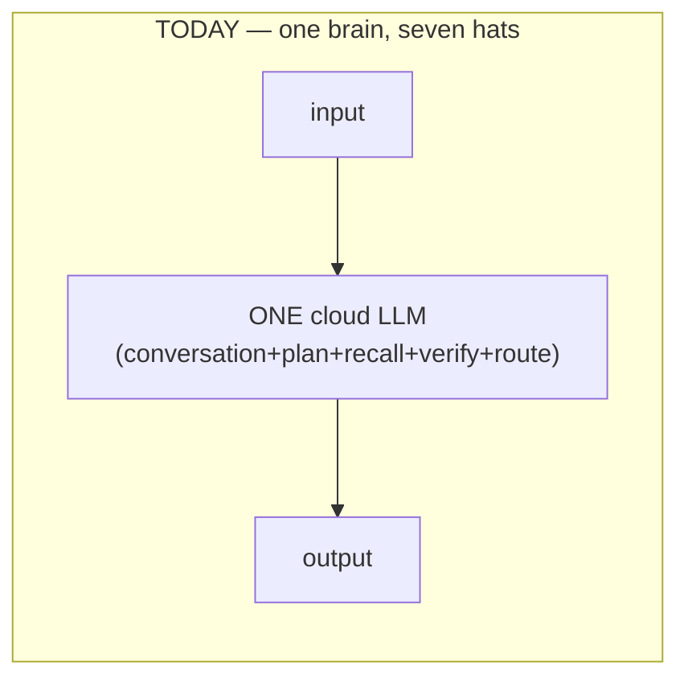
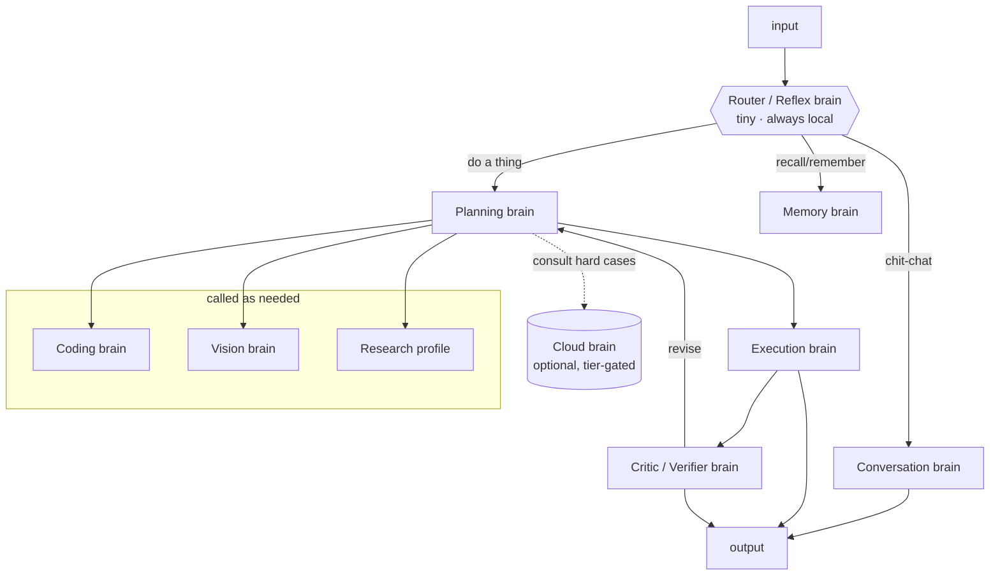
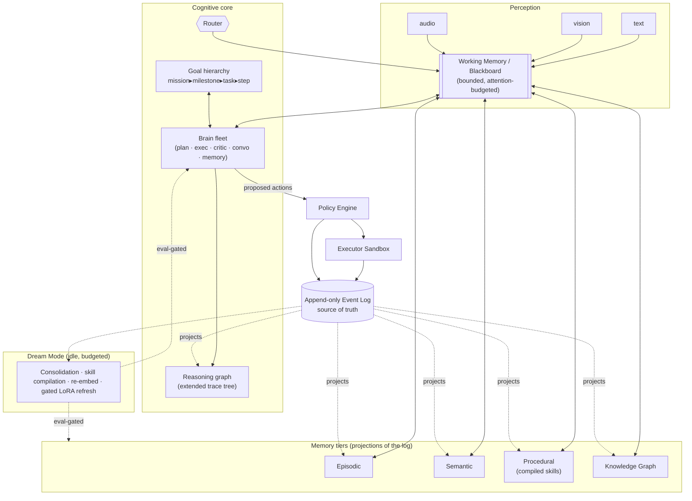
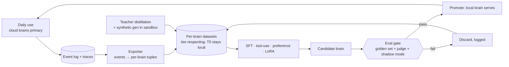

# M.I.K.E.Y — Intelligence Sovereignty

### Migrating from API-driven cognition to a self-hosted society of brains

**Status:** Design proposal · awaiting approval before any code changes
**Scope:** the *reasoning* path — how M.I.K.E.Y thinks, and how it stops renting that thinking from the cloud.
**Relationship to existing docs:** this is a new **axis** (model sovereignty) that runs *alongside* the Gen 1–10 roadmap in [03-roadmap.md](03-roadmap.md); it does not replace it. Every principle here is a continuation of [01-architecture-review.md](01-architecture-review.md) and [02-system-architecture.md](02-system-architecture.md), not a departure.

---

## 0. Thesis (read this even if you read nothing else)

Three claims drive every decision below.

1. **The brain today is one model doing seven jobs.** The whole of cognition is a single call — `gateway.complete(system, messages, TOOLS)` at [core/orchestrator/loop.py:121](core/orchestrator/loop.py). It is at once the conversationalist, planner, retriever, memory-writer, and verifier. "Multiple brains" does not exist yet; there is one brain wearing every hat.

2. **Sovereignty is won by decomposition first, replacement second — not by one heroic training run.** A solo developer cannot train a frontier reasoning model from scratch (see §11). But a solo developer *can* split the one call into a handful of specialized roles, keep the cloud API behind each of them, and then replace them **one small brain at a time**, smallest-and-safest first, each swap gated by evaluation. This is tractable, low-risk, and — crucially — makes the system *better* at every step, not just cheaper.

3. **"M.I.K.E.Y's own intelligence" is the architecture + your data + the persona, not virgin weights.** ChatGPT is *one generalist model*. M.I.K.E.Y should be *a bespoke society of small models wired to a lifelong event log*. That is **more** differentiated than a from-scratch model would be, and it is the only version of "own intelligence" a single person can actually build and keep improving for a decade. The weights may start from open bases; the *system* is unmistakably yours.

> **The metric stays the same as [01 §7](01-architecture-review.md): the number of consecutive actions M.I.K.E.Y takes that are correct, explainable, and reversible.** Sovereignty is only worth pursuing insofar as it raises that number (privacy, latency, cost, control) without lowering it (quality regressions). Every phase below is gated on that trade.

---

## 1. What the brain is today — an honest anatomy

### 1.1 The single cognitive call site

```
run_turn (loop.py)
  └─ ContextAssembler.assemble(user_input)      # deterministic: history + memory recall
  └─ for step in 0..MAX_STEPS:
        resp = gateway.complete(system, messages, TOOLS)   # ← THE ENTIRE BRAIN
        if resp.tool_calls: policy → executor → trace → append result
        else: final answer
```

There is exactly **one** place in the codebase where "thinking" happens, and it is that `complete()` call. Everything upstream (context assembly) and downstream (policy, executor, memory write, trace) is deterministic engineering. This is *good news*: the seam we need to cut cognition along already exists and is singular.

### 1.2 What that one call is secretly doing

| Hidden job | Where it "lives" today | Should become brain |
|---|---|---|
| Hold a conversation, carry persona/tone | `SYSTEM_PROMPT` in [context/assembly.py](core/context/assembly.py) | **Conversation** |
| Decide *whether* a tool is needed, *which*, and *with what args* | model's own judgement inside `complete()` | **Planner + Execution** |
| Decide *when* to recall memory / what to remember | model calling `memory_recall` / `memory_remember` | **Memory** |
| Check its own output before answering | nothing separate — self-check in-context | **Critic / Verifier** |
| Route easy vs hard requests | nothing — every turn hits the 70B model | **Router / Reflex** |

Five to seven cognitive functions, one prompt, one model. The prompt is already heroically overloaded (read [assembly.py:20-58](core/context/assembly.py) — it juggles persona, tool discipline, taint rules, memory citation, and anti-sycophancy in one breath). **A single generalist prompt is the current ceiling on quality.** Splitting it is an upgrade independent of localization.

### 1.3 What is already right (do not rebuild these)

- **The Model Gateway is a clean single socket.** [core/models/gateway.py](core/models/gateway.py) defines a provider-neutral `ModelAdapter` Protocol + `ChatMessage/ToolCall/ModelResponse`. Adding a `MikeyAdapter` (our own model) is a *drop-in*. The architecture anticipated this ([02 §8](02-system-architecture.md), [ADR-001](adr/ADR-001-gen1-tech-stack.md)).
- **The event log is a self-building training corpus.** Every turn, tool call, approval, denial, correction, and ingested doc is already an immutable event ([events/schema.py](core/events/schema.py)) with **provenance and privacy tier**. This is *exactly* the personalized dataset distillation needs — and it grows every day the system is used. This is the single most valuable asset for sovereignty.
- **The trace store is a proto reasoning-graph.** [core/trace/store.py](core/trace/store.py) already records each turn as a span tree (context → model_call → tool_calls → results). It is one short step from being a first-class reasoning graph *and* a source of labeled reasoning traces.
- **Embeddings are already local** ([models/embeddings.py](core/models/embeddings.py), nomic-embed-text via Ollama). One brain is already sovereign.
- **The fallback chain is a primitive hybrid router** ([gateway/app.py:47-65](core/gateway/app.py): groq → claude → ollama). It routes on *failure* today; it needs to route on *capability/cost/privacy*.
- **Safety spine is real and must be preserved verbatim:** policy engine ([policy/engine.py](core/policy/engine.py)), taint propagation, hash-chained audit, capability-scoped sandbox ([executor/tools.py](executor/tools.py)). **No sovereignty change may weaken these.** A local brain is still an untrusted planner; the executor still doesn't trust the core.

---

## 2. API dependency map — where the "brain" is rented

Four external "intelligence" sockets exist. Only two are the migration target.

| # | Socket | File | Role | Kind | Migration status |
|---|---|---|---|---|---|
| B1 | **Groq** (Llama-3.3-70B) | [models/groq_adapter.py](core/models/groq_adapter.py) | **Primary reasoning brain** | Cloud | **Target** — the main thing to localize |
| B2 | **Anthropic** (Claude) | [models/anthropic_adapter.py](core/models/anthropic_adapter.py) | Fallback + strongest teacher | Cloud | **Target** — demote to optional "consult" tier |
| B3 | **Ollama** (llama3.2 3B) | [models/ollama_adapter.py](core/models/ollama_adapter.py) | Offline fallback reasoning | **Local** | Structure exists; model too weak to trust |
| B4 | **Ollama** (nomic-embed) | [models/embeddings.py](core/models/embeddings.py) | Embeddings / retrieval | **Local** | ✅ Already sovereign |

Non-brain external calls: `web_fetch` in the sandbox ([executor/tools.py:128](executor/tools.py)) pulls *data*, not cognition — it stays, tainted as it already is.

**The entire sovereignty program reduces to: replace the reasoning served at B1/B2 with a local fleet, while keeping the option to "consult a bigger cloud brain" for the hardest fraction of requests — and enforce that Tier-0 (T0) data *never* reaches B1/B2 at all.** T0 enforcement belongs at the gateway (a hard constraint, per [02 §3](02-system-architecture.md)), and today it is **not yet implemented** — that is a P0 item, not a P4 one.

---

## 3. Bottlenecks — what actually blocks sovereignty (ranked)

1. **Monolithic prompt / single call site.** One model, seven jobs. Blocks both quality *and* incremental replacement. → decompose (P1).
2. **`complete()` has no routing metadata.** [ADR-001](adr/ADR-001-gen1-tech-stack.md) specifies `complete(request, {tier, capability, budget})`; the code is `complete(system, messages, tools)`. Without capability/tier/budget on the request, you cannot route by anything but availability. → P0.
3. **No reasoning eval harness.** [core/eval/retrieval.py](core/eval/retrieval.py) + [evals/golden_set.json](evals/golden_set.json) evaluate *retrieval*, not end-to-end reasoning or tool-use. **You cannot safely swap a brain you cannot measure.** This is the gating instrument for the entire program. → P0.
4. **No data exporter — the flywheel isn't turning.** The event log is a goldmine, but nothing turns events/traces into per-brain training tuples. Every day without this is training data you're logging but not shaping. → P0.
5. **No T0 privacy enforcement at the gateway.** Sovereignty's *point* is privacy; the tier field exists on events but nothing forces T0 to local inference. → P0.
6. **Weak local model + no real inference host for custom weights.** llama3.2-3B is explicitly "weak, hallucinates" ([groq_adapter.py:21-23](core/models/groq_adapter.py)). Ollama is fine for stock models but a custom fleet (LoRA adapters, small MoE, speculative decoding, batching) wants a real host (vLLM / llama.cpp / SGLang). → P2.
7. **No training infrastructure.** Greenfield. No `training/`, no distillation, no SFT/preference tooling. → P2+.
8. **Memory is single-tier.** [memory/store.py](core/memory/store.py) has notes + FTS + vectors, but not the episodic / semantic / procedural / working tiers the cognitive design needs — and no consolidation. → cognitive-arch track.
9. **No goal hierarchy, KG, or brain-to-brain bus.** Missions are flat linear steps ([missions/runner.py](core/missions/runner.py)); no knowledge graph; no shared workspace for multiple brains to collaborate. → cognitive-arch track.
10. **Latency/VRAM budget on consumer hardware.** A fleet of full models won't fit. Forces the architecture toward a **shared base + LoRA-per-brain** and/or a **compact MoE** (§7). A constraint, but a clarifying one.

---

## 4. The reframe — from one generalist to a society of specialists





The right unit is **not one model of any size**. It is a **fleet of small specialists** scheduled by a tiny router, each replaceable independently. This is the correct shape for three converging reasons:

- **Buildability (solo):** you can distill/train a 1–8B specialist; you cannot train a 200B generalist.
- **Runnability (consumer HW):** small active parameter counts + LoRA-swapping + a compact MoE fit a laptop/single GPU; a monolith does not.
- **Differentiation:** a society wired to a lifelong log is a genuinely different artifact from a chatbot — it is the JARVIS shape.

This directly satisfies [01 W1](01-architecture-review.md) ("roles, not seventeen agents"): the **structural brains** below are few and real; the domain "agents" from the vision (Finance, Medical, Presentation…) remain **capability profiles** — `{prompt pack, tool allowlist, policy set, preferred brain+tier}` — *data*, not code, exactly as [02 §6](02-system-architecture.md) already mandates.

---

## 5. The brain fleet

Structural brains (each may eventually get its own weights). "Profiles" are data layered on these, not separate models.

| Brain | Responsibility (single sentence) | Input → Output | Model class | Size (target) | Dense/MoE | From-scratch / Adapt / Distill | Localize priority |
|---|---|---|---|---|---|---|---|
| **Router / Reflex** | Classify each input (chat vs task vs recall vs mission) and choose brain(s) + tier/budget. The attention gate. | text + light context → routing decision | classifier / tiny LM | 0.3–1B | Dense | **From-scratch** (small; ownership is cheap and total here) | **1st** (safe, tiny, huge latency win) |
| **Memory** | Decide what to remember, dedup/supersede, detect contradiction, promote across tiers, consolidate in Dream Mode. | (candidate fact, existing memories) → write/skip/merge/flag | small instruct + logic | 1–3B | Dense | Distill from teacher + **train on the store's own logged decisions** | **2nd** (bounded task, real data exists) |
| **Emotion / prosody** | Read affect from text (later voice) to modulate tone and urgency. | text/audio → affect labels + confidence | classifier | <0.5B | Dense | **From-scratch** small | 3rd |
| **Conversation** | Dialogue, persona, tone — *the personality*. | dialogue + memory → reply | instruct LM | 3–8B | Dense (or LoRA on base) | **Adapt + persona-align** on your corpus | 4th |
| **Critic / Verifier** | Check outputs against acceptance criteria; drive self-correction. Deliberately *separate* from the planner. | (goal, output, evidence) → verdict + critique | reasoning LM | 3–8B | Dense | Distill from teacher critiques; train on eval outcomes | 5th |
| **Execution** | Turn a bound step into concrete tool args; read results; decide next micro-action. | (step, tool schema, last result) → tool call | tool-use LM | 3–7B | Dense | Distill from **verified sandbox trajectories** | 6th |
| **Planning** | Decompose goals into step-DAGs, order, estimate, delegate. The hardest reasoning. | goal + world state → plan DAG | **reasoning** LM (long CoT) | 8–14B (local) / cloud for hard | Dense local; **compact MoE** candidate | Distill (R1-style) + continued pretrain; **last to fully localize** | 7th (hardest) |
| **Coding** | Code understanding, generation, review, repo reasoning. | task + code context → code/patch | code LM | 7–14B | Dense | **Adapt** open code base + continued-pretrain on your repos | as needed |
| **Vision (VLM)** | Screen/OCR/diagram/chart/document understanding. | image + query → text | VLM | 3–8B | Dense | **Adapt** open VLM | Gen 6 |
| **Speech** | ASR, TTS (your voice), wake-word, speaker-id. | audio ↔ text | specialist stack | small each | — | Adapt ASR; **near-scratch personal TTS voice** = personality | Gen 6 |
| **World Model / Context Manager** | *Not an LLM.* Working memory, goal hierarchy, attention/context-assembly scoring, KG maintenance. | events → structured state | engineered + tiny models | — | — | **Build (from scratch, by definition)** | continuous |

Two deliberate positions in that table:

- **The Critic is a separate model from the Planner.** A model grading its own work in its own context is weak; independent verification is where reliability comes from. This is cheap insurance and a core JARVIS property ("did I succeed?" from [00 vision](00-vision.md) answered by a different brain).
- **The World Model is not a neural net.** Working memory, the goal tree, the attention scorer, the knowledge graph — these are *engineered cognitive machinery* with small models embedded, not one giant network. This is the "think beyond LLMs" the request asks for, and it is where genuine architecture (not prompt-craft) lives.

---

## 6. The cognitive architecture — the OS around the fleet

The brains are the muscles. This is the nervous system. Most of it is *engineered*, projects over the event log (per [02 §4](02-system-architecture.md)), and — critically — much of it already has bones in the repo.



Mapping the requested concepts to concrete homes (and their current status):

| Concept | Concrete realization | Status in repo today |
|---|---|---|
| **Working memory** | Bounded per-turn/session blackboard = assembled context + active goal + recent results, under a token/attention budget | Partial: `ContextAssembler` + `messages` ([context/assembly.py](core/context/assembly.py)) |
| **Episodic memory** | Event-linked summaries of "what happened" (turns, missions) | Raw events exist; summarizer TODO |
| **Semantic memory** | Stable facts/preferences + confidence + staleness + tier | First form: memory notes ([memory/store.py](core/memory/store.py)); needs confidence/staleness/tiers |
| **Procedural memory** | Recurring tasks compiled to deterministic, reviewed scripts (LLM improvisation → verified automation) | **Missing** — high-leverage (Gen 7 "skill compilation") |
| **Goal hierarchy** | mission ▸ milestone ▸ task ▸ step tree owned by scheduler | Flat linear steps today ([missions/runner.py](core/missions/runner.py)) |
| **Attention management** | Router + context-assembly scorer decide what enters WM and which brain runs | Budget logic exists; scoring is BM25+recency only |
| **Reasoning graphs** | Turn's thoughts/subgoals/tool-calls as a DAG the planner writes and critic reads | **Trace store is already a span tree** ([trace/store.py](core/trace/store.py)) — promote it |
| **Knowledge graph** | Entities/relations with per-edge provenance, derived from the log | Missing (Gen 5) — design as projection, never source of truth ([01 §1.2](01-architecture-review.md)) |
| **Brain communication** | Typed **blackboard** bus: brains post to shared WM; router schedules — avoids N² coupling | Missing — introduce with P1 decomposition |
| **Reflection / verification / self-eval** | Critic brain + eval harness; reflection proposes, harness gates | Eval exists for retrieval only; Critic is P1 |
| **Self-improvement** | Gated LoRA refresh + skill compilation, both eval-gated | Missing (Gen 7) |
| **Context compression / consolidation** | Dream-Mode jobs: summarize episodes, promote facts, compile skills, re-embed | Missing |
| **Background / parallel thinking** | Scheduler runs brains concurrently (plan drafts while critic verifies; memory consolidates in background) | Async spine supports it; scheduler TODO |

**The blackboard is the key new structural piece.** Instead of brains calling each other (N² coupling, the thing [01 W1](01-architecture-review.md) warns against), every brain reads/writes a shared, typed **working-memory blackboard**; the router/scheduler decides who runs when. This is the classic cognitive-architecture pattern and it satisfies the vision's "communicate through an event bus" cleanly.

---

## 7. Model strategy — concrete recommendations

The roadmap is deliberately **model-agnostic** (the whole point of the Gateway). Specific model names churn quarterly; the *shape* does not. Below is current as of early 2026 with that caveat.

### 7.1 The unifying trick: one base + a LoRA fleet

Running six separate 7B models on a laptop is impossible. Running **one strong local base (7–14B) + a hot-swappable LoRA adapter per brain** is very possible — it is "multiple brains" at roughly *one* model's memory cost, with per-brain specialization from cheap-to-train adapters. This is the near-term backbone of the whole fleet, and it makes each brain independently trainable and eval-gated without a new full model.

- **Backbone candidate:** **Qwen3-class** dense (7–14B) — permissive license, strong tool-use, good small sizes, multilingual. Alternatives: Llama-3.x/4, Gemma-3, Mistral/Ministral.
- **Serving:** vLLM (multi-LoRA serving is a first-class feature) or llama.cpp for pure-CPU/edge. Ollama stays as the zero-friction path for stock models and the offline floor.
- **Latency:** speculative decoding (a 0.5B drafter for the 7–14B base) + KV-cache reuse across a turn's multiple calls.

### 7.2 Sizes by compute tier (be honest about hardware)

| Your compute | Local reasoning ceiling | Training you can realistically do |
|---|---|---|
| Laptop / 8–12 GB GPU | 3–8B **quantized** + LoRA fleet; router/memory/emotion local | LoRA/QLoRA SFT of small brains; distillation from cloud logs |
| Single 24 GB GPU (e.g. 4090) | 8–14B + LoRA fleet; most brains local, planner hybrid | QLoRA up to ~14B; preference tuning (DPO/KTO); small from-scratch router |
| Workstation 2–4× 24–48 GB | 14–32B local; compact MoE feasible; planner localizable | Full fine-tunes ≤14B, continued pretraining on your corpus, MoE experiments |
| Rented cloud (bursty) | any, but you pay per hour | Larger distillation runs, VLM/ASR adaptation, from-scratch *small* models |

### 7.3 Dense vs MoE — the decision

- **Now (the fleet): dense small specialists + LoRA.** Simpler to train, serve, and reason about; each brain *is already* an "expert," so you get the MoE benefit (specialization) without MoE's training pain. **Default.**
- **Later (a unified "own model"): a compact MoE** — e.g. ~8 experts × 1–3B, ~3–4B active — is attractive *specifically* for consumer latency: big-model capacity, small active-param inference cost. Consider it only when you want to collapse the fleet into one artifact and have the compute (DeepSeek-V3 / Mixtral / Qwen3-MoE as references).
- **Never (solo): a large dense monolith you pretrain.** Infeasible and pointless (§11).

### 7.4 Reasoning, multimodal, speech, vision picks (adapt, don't invent)

- **Reasoning (Planning/Critic):** distill from an R1-style long-CoT teacher into an 8–14B student; DeepSeek-R1-distill / QwQ-class as reference for the reasoning recipe.
- **Coding:** Qwen-Coder / DeepSeek-Coder class, continued-pretrained on *your* repos.
- **Vision:** Qwen-VL / InternVL / Molmo / Pixtral class; adapt with a screen/document/diagram adapter.
- **ASR:** faster-whisper (large-v3) or distil-whisper; Moonshine for streaming/edge. **Wake word:** openWakeWord. **TTS:** Piper/Kokoro for utility; StyleTTS2/XTTS for a **cloned personal M.I.K.E.Y voice** (this *is* personality and is a legitimate near-from-scratch artifact). **Speaker-id/emotion:** small classifiers.
- **Embeddings:** keep nomic; upgrade path BGE-M3 / Qwen3-Embedding.

### 7.5 From scratch vs adapt — the verdict (this is the answer to "the model" section)

> **Do not train a general reasoning LLM from scratch. It is not feasible solo, and attempting it would kill the project (§11). "Own intelligence" is delivered by the architecture + your data + persona alignment, layered on open backbones.**

**Train from scratch (small, tractable, high ownership-value):**
- Router / Reflex brain (tiny classifier-LM).
- Emotion/prosody classifier.
- The **World Model machinery** — working memory, goal-hierarchy planner scaffolding, attention/context scorer, KG extractor policies (small models + algorithms). This is *inherently* from-scratch and is where JARVIS-ness actually lives.
- A **personal TTS voice** (near-scratch fine-tune) — the literal voice of M.I.K.E.Y.

**Adapt + continued-pretrain + distill + persona-align (the reasoning fleet):**
- Conversation, Planning, Execution, Critic, Coding, Vision — all on open bases, made *yours* by (a) continued pretraining on your domain+corpus, (b) distillation from the cloud teachers you're *already running*, (c) persona/style data, (d) tool-use traces from your own event log.

The result is a system whose behavior no one else has, because no one else has your log, your persona data, your skill library, or your fleet wiring — even though individual brains began as open weights. That is a stronger form of "own" than virgin weights would be.

---

## 8. The training pipeline — a data flywheel, not a one-off

The core insight: **M.I.K.E.Y is already generating its own training data every time you use it.** Cloud-primary operation *is* the data-collection phase — if we add an exporter. The pipeline below turns that into a self-improving loop, with a verifier and an eval gate as the safety spine throughout (mirroring the repo's policy/eval philosophy).



Mapping every requested capability to a stage:

| Requested | How it's produced | Signal / label source |
|---|---|---|
| **Dataset collection** | Exporter over event log + traces (read-only, non-destructive) | already-logged turns, tool calls, approvals, corrections |
| **Synthetic data** | Self-instruct + persona-conditioned generation; **tool trajectories generated and *verified in the real sandbox*** (keep only trajectories that pass) | executor success = automatic label ("RL from execution", cheaply) |
| **Instruction tuning** | Per-brain SFT on curated + distilled + synthetic | teacher outputs, user-accepted answers |
| **Tool-use training** | Real + verified-synthetic trajectories against the actual `TOOLS` schema | executor `ok` + policy compliance |
| **Memory training** | Train Memory brain on the store's own `remember()` decisions (dedup/supersede/flag) | logged `RememberResult` outcomes ([memory/store.py](core/memory/store.py)) |
| **Planning** | goal → step-DAG from successful missions + teacher plans | mission completion + verifier score |
| **Reflection / self-correction** | Critic on (output, criteria, verdict); revise-given-critique pairs | eval-harness outcomes as labels |
| **Long-term memory / personalization** | Continued pretrain / LoRA on your corpus → **bounded** style profiles ([01 W6](01-architecture-review.md)) | your writing/code/repos |
| **Computer-use / agentic** | Sandbox trajectory learning; later screen+VLM grounding | executor outcomes; task success |
| **Voice interaction** | ASR fine-tune on your acoustics; personal TTS; wake-word personalization | your audio (T0, local-only training) |
| **Vision-language alignment** | Adapter-align VLM to screen/doc/diagram | OCR/layout ground truth + your screenshots |
| **Multimodal reasoning** | Fuse vision+text+memory in the assembler; train planner to consume it | multimodal task success |
| **Code understanding** | Continued pretrain on your repos + adapt code brain | your commits, tests passing |
| **Decision making** | Preference tuning (DPO/KTO) over accepted vs rejected actions/plans | your approve/deny history (already logged by policy!) |
| **Self-correction** | Critic-in-the-loop + revise objectives | verifier verdicts |
| **Online learning** | **See below — deliberately constrained** | — |
| **Knowledge updating** | **Retrieval-first, not weight-first** (below) | new events/KG |

### 8.1 The online-learning stance (the most important safety call in the whole doc)

> **New *knowledge* updates instantly and safely via the memory/retrieval system (the event log + KG *is* the online knowledge — no retrain needed to learn a new fact). New *skills/behavior* update slowly and safely via periodic, eval-gated LoRA refreshes during Dream Mode. There are NO unsupervised online gradient steps on a companion, ever.**

Why: live weight updates on a personal assistant are how you get catastrophic forgetting, silent drift, and one-shot memory-poisoning. The repo's existing instinct — *nothing self-modifies without passing evals* ([02 §10](02-system-architecture.md), Gen 7) — extends directly to weights. Knowledge = data (fast path). Behavior = weights (slow, gated path). This distinction keeps a lifelong system stable.

### 8.2 The promotion gate (how a local brain earns production)

A candidate brain replaces a cloud brain only after: (1) passing the golden-task + LLM-judge eval suite, **and** (2) running in **shadow mode** — answering in parallel with the cloud brain, scored against it — for a set period with no regression. This is the model-migration analogue of the roadmap's "30 consecutive days" generation gate. Trust is earned by measurement, never by optimism.

---

## 9. The migration roadmap — track "S" (Sovereignty), pinned to the Gens

Six phases, refined from your outline, each with exit criteria, each pinned to the existing Gen roadmap so this is one program, not two.

### S0 — Instrument & abstract *(pairs with Gen 1–2; start right after approval)*
Make the seam real. **No user-visible change; API stays primary.**
- Upgrade `complete()` to carry `{tier, capability, budget}` (close the [ADR-001](adr/ADR-001-gen1-tech-stack.md) ↔ code gap).
- Enforce **T0 → local only** at the gateway (privacy is the point).
- Build the **Exporter** (event/trace → per-brain datasets, tier-respecting).
- Build the **reasoning/tool-use eval harness** + shadow-mode plumbing.
**Exit:** every turn is exportable as training tuples; T0 provably never hits cloud; a golden reasoning set runs in CI; shadow mode can score any adapter against the incumbent.

### S1 — Decompose the monolith into brains *(still API-backed)* *(pairs with Gen 3)*
Split the one `complete()` into **Router + Conversation + Planner + Execution + Critic + Memory** roles over the gateway + a **blackboard**. Each brain gets its own prompt, tools, and — now — its own logged I/O.
**Exit:** turns flow through ≥4 distinct roles; behavior measurably improves on the golden set vs the monolith; each brain emits a clean per-brain corpus. *(Pure orchestration refactor — no training yet.)*

### S2 — Local inference host + first local brains *(pairs with Gen 3–4)*
Stand up a real inference host (vLLM/llama.cpp) behind a `LocalAdapter` with multi-LoRA. Localize the **smallest, safest** brains first — **Router, Memory, Emotion** — distilled from teachers, eval-gated, shadow-mode before promotion.
**Exit:** ≥3 brains served locally with no golden-set regression; router runs 100% local; median turn latency down.

### S3 — Real hybrid routing *(pairs with Gen 4)*
The Router decides per-request **local vs cloud** by capability/latency/cost/**privacy tier** (T0 forced local). The failure-only fallback becomes intelligent routing.
**Exit:** majority of turns served locally end-to-end; cloud used only for flagged-hard requests; T0 never leaves device; monthly spend down measurably.

### S4 — The own fleet *(pairs with Gen 5, alongside graph)*
Distill + continued-pretrain + persona-align **Conversation, Planning, Execution, Critic, Coding** onto the shared base as a LoRA fleet (consider compact MoE if compute allows). Localize hard brains as evals permit; cloud demoted to optional "consult a bigger brain" for the hardest fraction.
**Exit:** ≥80% of daily work runs with zero cloud calls at no quality cost; a distinct **M.I.K.E.Y persona** is measurable (style match on a held-out set); planner localized for common missions.

### S5 — Perception & multimodal own brains *(pairs with Gen 6)*
Vision (VLM adapt), Speech (ASR/TTS/wake/emotion), screen understanding — all local. **Own cloned voice = personality.**
**Exit:** hands-free daily driving; perception errors degrade gracefully (states uncertainty, never acts on a misread — Gen 6 criterion).

### S6 — Continuous gated self-improvement + bounded autonomy *(pairs with Gen 7 + 10)*
Dream-Mode **consolidation** (episodic→semantic promotion, re-embedding), **skill compilation** (procedural memory: recurring tasks → reviewed scripts that run with *no* LLM call), **gated LoRA refresh**, KG maturation, standing delegations within earned policy envelopes.
**Exit:** ≥3 self-proposed changes adopted through the gate with measured improvement; ≥1 workflow compiled to a no-LLM automation; weeks-long standing missions with zero policy violations; every autonomous action explainable from traces. Full offline cognitive OS.

**Invariant across all phases:** every model promotion passes eval + shadow mode; T0 privacy enforced at the gateway; the event log is the flywheel; nothing self-modifies without passing evals; the policy/executor/audit safety spine is never weakened.

---

## 10. Design principles preserved (continuity with 01–03 + ADR)

- **Event log is the truth; everything (memory tiers, KG, reasoning graph, *and now training data*) is a rebuildable projection.** ([01 §1.2](01-architecture-review.md), [02 §4](02-system-architecture.md))
- **Roles, not agents; profiles are data.** ([01 W1](01-architecture-review.md), [02 §6](02-system-architecture.md))
- **Trust is earned by measurement.** Model promotion = the eval gate; same philosophy as the generation gate. ([02 §10](02-system-architecture.md))
- **Local-first, tier-gated privacy — now actually enforced at the gateway.** ([02 §3](02-system-architecture.md))
- **The Gateway is the one door; adapters hide vendors — including our own.** ([02 §8](02-system-architecture.md), [ADR-001](adr/ADR-001-gen1-tech-stack.md))
- **Modular monolith + two process boundaries;** the inference host is the second boundary, exactly as [02 §1](02-system-architecture.md) already reserved.

---

## 11. Risks & honest constraints (a principal architect states these plainly)

1. **You cannot train a frontier reasoning model from scratch solo.** Millions of GPU-hours, petabytes of curated data, a team. Pursuing it directly would consume the project and ship nothing. → *Adapt + distill + persona; scratch only the small pieces.* This is not a compromise; it is the correct engineering answer.
2. **Distillation quality is capped by the teacher and by license.** Check each provider's terms on training from outputs; prefer teachers whose licenses permit it, and lean on **verified-in-sandbox** synthetic data (self-labeled by execution) which has no such constraint.
3. **Catastrophic forgetting & drift.** Mitigated by the gated-LoRA / retrieval-first split (§8.1) and shadow mode. Never live gradient steps.
4. **Eval overfitting.** A golden set you optimize against stops measuring truth. Rotate it, grow it from *new* real corrections, and always pair it with shadow-mode-vs-teacher on live traffic.
5. **Latency/VRAM on consumer hardware** is the binding constraint on local quality. → LoRA fleet, quantization, speculative decoding, compact MoE; accept a hybrid "consult cloud" tier for the hardest 1% indefinitely — sovereignty is 99% local, not a purity contest.
6. **Safety regressions.** A *local* planner is still an untrusted planner. The policy engine, taint tracking, sandbox, and audit chain apply identically to local brains. Prompt-injection defense does not relax because the model is yours.
7. **Scope.** This is a multi-year program (it pins to Gen 3–10). S0 is days of work; S4+ is the long haul. The value is real at *every* phase (S1 alone improves quality; S2–S3 cut cost/latency and win privacy) — so it never becomes an all-or-nothing bet.

---

## 12. First concrete step after approval (S0 — non-destructive)

Nothing below deletes or rewrites existing behavior; it *instruments* and *abstracts*.

1. `complete(request, {tier, capability, budget})` on the Gateway; adapters ignore unknown fields until routing exists.
2. Gateway hard-rule: `tier == T0 → local adapter only` (+ a test that proves it).
3. `training/exporter.py`: event log + traces → per-brain JSONL datasets, respecting provenance/tier.
4. `core/eval/reasoning.py` + a small end-to-end tool-use golden set + shadow-mode harness (answer with two adapters, score, log — promote nothing yet).

These four are the foundation the entire program stands on, and they are safe to build while the cloud API keeps serving every turn exactly as it does today.

---

## 13. Decisions locked — 2026-07-24

Two direction choices are settled; the rest of the doc should be read through them.

1. **Stance: the pragmatic bespoke fleet is the committed path.** From-scratch only for the small, high-ownership pieces (Router, Emotion, World-Model machinery, personal voice); everything reasoning-shaped is adapted + distilled + persona-aligned onto open backbones (§7.5). "Maximal from-scratch" is explicitly *not* the plan — it's noted only as the boundary we're choosing to stay inside.

2. **Compute posture: bursty cloud rental — which means we must separate *training* compute from *serving* compute.** This is the one thing to hold in mind:
   - **Training compute = rented, bursty, generous.** This is a *good* fit for the pipeline: distillation runs, QLoRA/DPO up to ~14B, VLM/ASR adaptation, and small from-scratch models all fit into rented A100/H100 bursts. §8's flywheel is unaffected — the exporter and eval harness (S0) run locally on CPU regardless.
   - **Serving compute is a different, unanswered question.** You do **not** want to rent a GPU 24/7 just to *serve* inference — that reburns the cost and privacy sovereignty is meant to win. Sovereign *serving* needs a **local daily-driver target** (whatever GPU/CPU M.I.K.E.Y actually runs on when you use it). Until that target is known, the local model sizes in §7.2 are provisional.
   - **Therefore:** S0–S1 (instrument, decompose) proceed identically — they're cloud-backed and hardware-independent. **The daily-driver serving box must be decided before S2** (stand up the local host), because it sets the LoRA-fleet base size and quantization. This is a checkpoint, not a blocker for starting.

*Everything else in the doc stands as written.*

---

*Sovereignty is not the goal. Trust is. Sovereignty is worth pursuing exactly as far as it makes M.I.K.E.Y more private, faster, cheaper, and more yours — without making it any less correct, explainable, or reversible. Every phase above is gated on that trade, and none of it starts until you approve the direction.*
